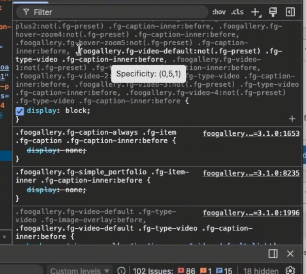

- [x] Icon colors for to match overlay colors.
- [x] Update comment count in thumb from lightbox.
- [x] Add likes button to lightbox.
- [x] Add error message display to lightbox comments with Try Again.
- [x] Fix share icons spacing (mobile view).
- [x] Share icon hover state.
- [x] hideCounts conflicts with hideCommentsZero
- [x] Add VK share link: https://gist.github.com/saippuakauppias/247af51c6ed50503afe4
- [x] Update share icons
- [x] Fix crossorigin attribute
- [ ] Position share links in info: info-top, info-bottom
- [ ] Fix sticky video icon on portfolio 
- [x] If hide count on thumb icons, show title with count
- [x] Fix social download link to point to full-size image
- [x] Share links using '/' will resolve to the current url